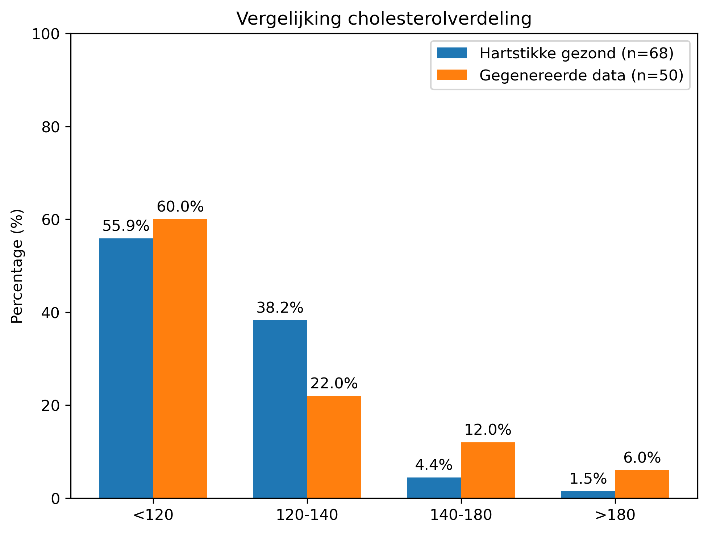
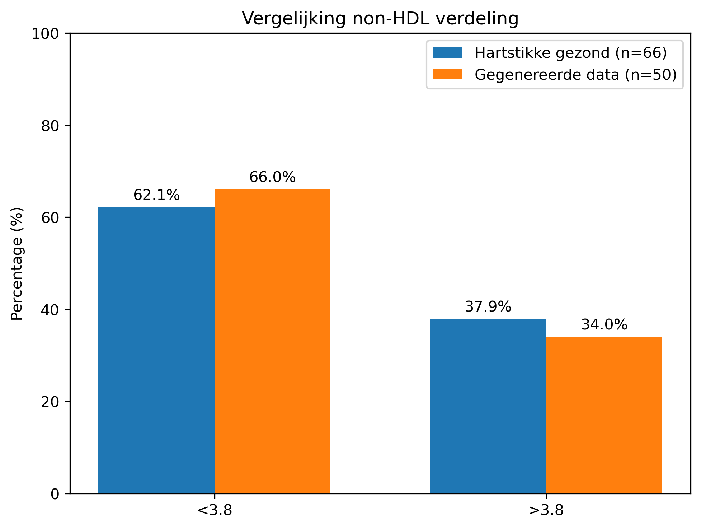
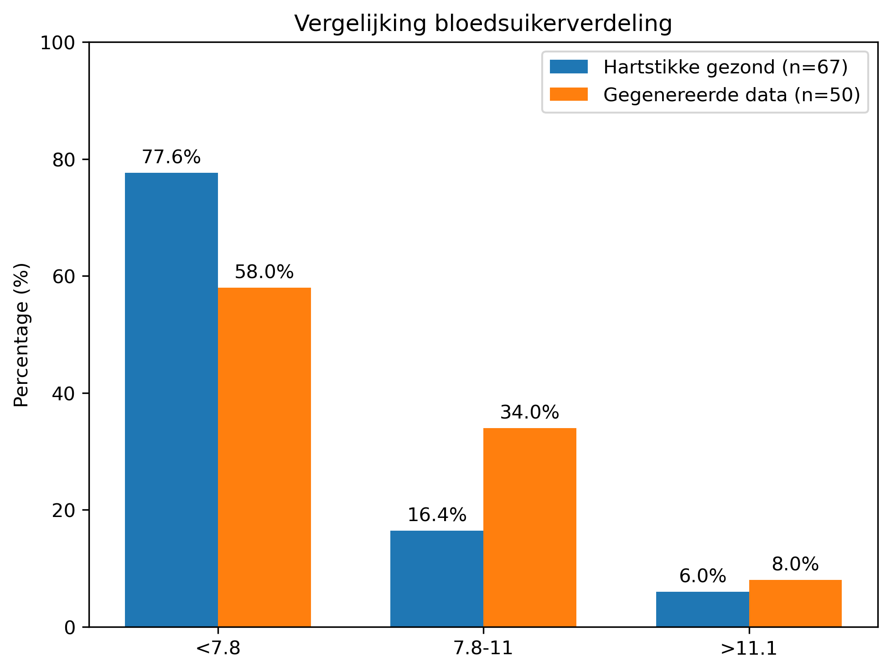
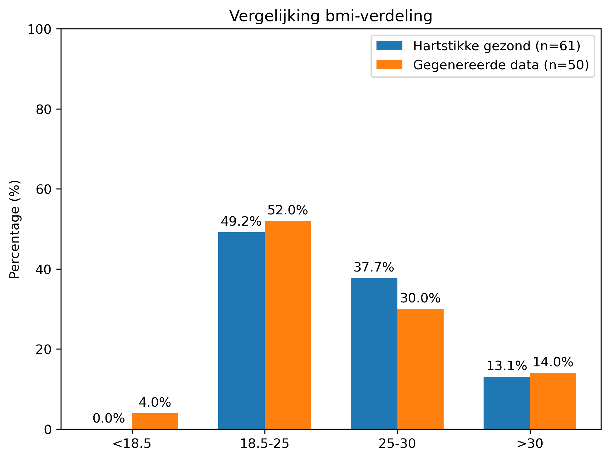

# Uitleg gegenereerde data

De toegereikte ECG-data is rechtsstreeks gebruikt. 
Voor de overige categorieën zijn er eerst 'meest voorkomende categorieën' met een normaalverdingsvorm gegenereerd, waar ongezonde categorieën oplopend minder kans hebben om gegenereerd te worden (Dit bestand is jammer genoeg niet opgeslagen, zie Vertaling naar excel - generatie van modi). Vervolgens zijn de categorieën omgezet naar oplopende numerieke categorie-indexen ($x_i$). En is er vervolgens een gewogen categoriegemiddelde berekend, waarbij categorieën dicht bij de modus meer gewicht krijgen dan categorieën verder van de modus.

Er is gebruikgemaakt van een gewogen 'gemiddelde' waarbij de gewichten zijn bepaald met een Gaussische functie rond de modus (meest voorkomende categorie).
Hierbij krijgen categorieën die dichter bij de modus liggen een hoger gewicht dan categorieën die verder van de modus afliggen. Voor deze methode is gekozen omdat de werkelijke verdeling van de data onbekend is. Er is daarom aangenomen dat waarden die dichter bij de meest voorkomende categorie liggen waarschijnlijker zijn dan waarden die verder van deze categorie af liggen. Daarnaast is aangenomen dat de populatie overwegend gezond is, waardoor de meest voorkomende categorie in de richting van de gezonde categorieën is geplaatst.

| Non-HDL     | Bloedsuiker  | Bloeddruk       | Cholesterol | BMI             |
| ----------- | ------------ | --------------- | ----------- | --------------- |
| ***< 3.8*** | ***< 7.8***  | ***< 120***     | ***< 5***   | < 18.5          |
| > 3.8       | 7.8 - 11     | ***120 - 140*** | 5 - 6.5     | ***18.5 - 25*** |
|             | > 11.1       | 140 - 180       | 6.5 - 8     | 25 - 30         |
|             |              | > 180           | > 8         | > 30            |

tabel 1. gezonde categorie per meetwaarde (***gezond***)

Aangezien iedere variabele behalve bloeddruk één gezonde categorie heeft, is voor deze variabelen (n=1) gekozen. Voor bloeddruk is (n=2) gebruikt, omdat zowel categorie 1 als categorie 2 als gezond worden beschouwd. Hierdoor wordt categorie 2 niet extra bestraft wanneer deze als modus voorkomt.

Voor BMI is een andere benadering gebruikt. De gezonde categorie bevindt zich hier in categorie 2, terwijl zowel categorie 1 (ondergewicht) als de hogere categorieën (overgewicht en obesitas) als minder gezond worden beschouwd. Daarom is gebruikgemaakt van de absolute waarde (|x_i-n|), zodat afwijkingen aan beide kanten van de gezonde categorie worden bestraft. Hierdoor ontstaat een voorkeur voor categorie 2 ongeacht of de afwijking naar boven of naar beneden plaatsvindt.

## Formules

De originele formule voor Gaussian kernel smoother is:

```math
K(x^*,x_i) = \exp(- \frac{(x^* - x_i)^2}{2b^2})
```
waar $x^*$ het evaluatiepunt is en b (sigma in excel) de lengteschaal is.

De gebruikte gewichten zijn berekend met:
```math
w_i = \exp( -\frac{(x_i-modus)^2}{2b^2})
```

De correctie voor alles behalve BMI wordt op de volgende manier berekend:
```math
\exp(- \lambda \max\{0, x_i-n\})
```
En voor BMI:
```math
\exp(-\lambda |x_i-n|)
```

Waarin n de hoeveelheid gezonde categorieën is en waarbij:

- $x_i$ = de numerieke waarde van een categorie  
- modus = de modus (meest voorkomende categorie)  

Het uiteindelijke gemiddelde is bij alles behalve BMI vervolgens berekend als:
```math
\bar{x} =\frac
{\sum x_i \cdot \exp\!\left(-\frac{(x_i-\text{modus})^2}{2b^2}-\lambda \max\{0, x_i-n\}\right)}
{\sum \exp\!\left(-\frac{(x_i-\text{modus})^2}{2b^2}-\lambda \max\{0, x_i-n\}\right)}
```

Het gemiddelde voor BMI is berekend als:
```math
\bar{x} =\frac
{\sum x_i \cdot \exp\!\left(-\frac{(x_i-\text{modus})^2}{2b^2}-\lambda |x_i-n|\right)}
{\sum \exp\!\left(-\frac{(x_i-\text{modus})^2}{2b^2}-\lambda |x_i-n|\right)}
```

- n was hier bij alles 1 behalve bij Bloeddruk (Bovendruk).
- b was bij allen 1
- $\lambda$ of de 'bias' was 0.14 om het niet al te veel af te laten wijken van de originele categorie
\
## Vertaling naar excel

<h3>generatie van modi</h3>
Een voorbeeld van hoe de modi berekend zijn, in dit geval hoe de waarde van bloeddruk gegenereerd zou zijn:

=LET( r; RAND()*100; IFS( r<=63;"<120"; r<=83;"120-140"; r<=98;"140-180"; TRUE;">180"))

waar <120 63%, 120-140 20%, 140-180 15%, en >180 2% kans heeft om te genereren. Dit zijn bedachte hoeveelheden en zal dus niet (100%) met de realiteit overeenkomen. De gekozen percentages zijn gebaseerd op de aanname dat de populatie overwegend gezond is en zijn uitsluitend gebruikt om plausibele voorbeelddata te genereren.

<h3>berekening gewogen gemiddelde</h3>
Voor de functie die de maximale waarde benut is de volgende formule in excel gebruikt:

=SUM(\
$S$56*EXP(-(($S$56-$S28)^2)/(2*$S$61^2)-$S$63*MAX(0;$S$56-$S$65));\
$S$57*EXP(-(($S$57-$S28)^2)/(2*$S$61^2)-$S$63*MAX(0;$S$57-$S$65));\
$S$58*EXP(-(($S$58-$S28)^2)/(2*$S$61^2)-$S$63*MAX(0;$S$58-$S$65));\
$S$59*EXP(-(($S$59-$S28)^2)/(2*$S$61^2)-$S$63*MAX(0;$S$59-$S$65))\
)/\
SUM(\
EXP(-(($S$56-$S28)^2)/(2*$S$61^2)-$S$63*MAX(0;$S$56-$S$65));\
EXP(-(($S$57-$S28)^2)/(2*$S$61^2)-$S$63*MAX(0;$S$57-$S$65));\
EXP(-(($S$58-$S28)^2)/(2*$S$61^2)-$S$63*MAX(0;$S$58-$S$65));\
EXP(-(($S$59-$S28)^2)/(2*$S$61^2)-$S$63*MAX(0;$S$59-$S$65))\
)\
\
en voor de functie die de absolute waarden gebruikt:\
\
=SUM(\
$AA$56*EXP(-(($AA$56-$AA28)^2)/(2*$AA$61^2)-$AA$63*ABS($AA$56-$AA$65));\
$AA$57*EXP(-(($AA$57-$AA28)^2)/(2*$AA$61^2)-$AA$63*ABS($AA$57-$AA$65));\
$AA$58*EXP(-(($AA$58-$AA28)^2)/(2*$AA$61^2)-$AA$63*ABS($AA$58-$AA$65));\
$AA$59*EXP(-(($AA$59-$AA28)^2)/(2*$AA$61^2)-$AA$63*ABS($AA$59-$AA$65))\
)/\
SUM(\
EXP(-(($AA$56-$AA28)^2)/(2*$AA$61^2)-$AA$63*ABS($AA$56-$AA$65));\
EXP(-(($AA$57-$AA28)^2)/(2*$AA$61^2)-$AA$63*ABS($AA$57-$AA$65));\
EXP(-(($AA$58-$AA28)^2)/(2*$AA$61^2)-$AA$63*ABS($AA$58-$AA$65));\
EXP(-(($AA$59-$AA28)^2)/(2*$AA$61^2)-$AA$63*ABS($AA$59-$AA$65))\
)\
\
Met S56-S59: $x_i$, S28:modus, S61: b, S63: $\lambda$ & S65: n\
Voor de tweede geldt hetzelfde maar bevind het zich in een andere kolom dus is S vervangen door AA.

## Uitwerkingen

<h3>Uitwerkingen formule met max() in richtingaanwijzer<h3>

<h5>Uitwerkingen met modus = 3 & n = 1 en n = 2<h5>

```math
\begin{align}
e^{-\frac{(1-3)^2}{2\cdot1^2} - 0.14\cdot\max(0, 1-1)} \; = \; e^{-\frac{4}{2} - 0.14 \cdot 0} \; = \; e^{- 2} \; = \; 0.1353352832 \\        
e^{-\frac{(2-3)^2}{2\cdot1^2} - 0.14\cdot\max(0, 2-1)} \; = \; e^{-\frac{1}{2} - 0.14 \cdot 1} \; = \; e^\frac{16}{25} \; = \; 0.527292424 \\
e^{-\frac{(3-3)^2}{2\cdot1^2} - 0.14\cdot\max(0, 3-1)} \; = \; e^{0 - 0.14 \cdot 2} \; = \; e^ {- 0.28} \; = \; 0.7557837415 \\
e^{-\frac{(4-3)^2}{2\cdot1^2} - 0.14\cdot\max(0, 4-1)} \; = \; e^{-\frac{1}{2} - 0.14 \cdot 3} \; = \; e^{- \frac{23}{25}} \; = \; 0.3985190411 \\
\\
\frac{1(0.1353352832)+2(0.527292424)+3(0.7557837415)+4(0.3985190411)}{0.1353352832 + 0.527292424 + 0.7557837415 + 0.3985190411} \; = \; \frac{5.05134752}{1.81693049} \; = \; 2.780154523 \; ≈ \; 2.78
\\
\\
\\
\\
\\
\\
\\
\\
e^{-\frac{(1-3)^2}{2\cdot1^2} - 0.14\cdot\max(0, 1-2)} \; = \; e^{-\frac{4}{2} - 0.14 \cdot 0} \; = \; e^{- 2} \; = \; 0.1353352832 \\        
e^{-\frac{(2-3)^2}{2\cdot1^2} - 0.14\cdot\max(0, 2-2)} \; = \; e^{-\frac{1}{2} - 0.14 \cdot 0} \; = \; e^{-\frac{1}{2}} \; = \; 0.606530659713 \\
e^{-\frac{(3-3)^2}{2\cdot1^2} - 0.14\cdot\max(0, 3-2)} \; = \; e^{0 - 0.14 \cdot 1} \; = \; e^ {- 0.14} \; = \; 0.869358235399 \\
e^{-\frac{(4-3)^2}{2\cdot1^2} - 0.14\cdot\max(0, 3-2)} \; = \; e^{-\frac{1}{2} - 0.14 \cdot 2} \; = \; e^{-0.78} \; = \; 0.458406011305 \\
\\
\frac{1(0.1353352832)+2(0.606530659713)+3(0.869358235399)+4(0.458406011305)}{0.1353352832 + 0.606530659713 + 0.869358235399 + 0.458406011305} \; = \; \frac{5.79009535404}{2.06963018962} \; = \; 2.79764732032 \; ≈ \; 2.80
\end{align}
```
<h3>Uitwerkingen formule met absolute waarde in richtingaanwijzer<h3>
  
<h5>Uitwerkingen met modus = 3 & n = 2<h5>

```math
\begin{align}
e^{-\frac{(1-3)^2}{2\cdot1^2} - 0.14 \cdot |1-2|} \; = \; e^{-\frac{4}{2} - 0.14 \cdot 1} \; = \; e^{- 2.14} \; = \; 0.117654843022 \\        
e^{-\frac{(2-3)^2}{2\cdot1^2} - 0.14 \cdot |2-2|} \; = \; e^{-\frac{1}{2} - 0.14 \cdot 0} \; = \; e^{-\frac{1}{2}} \; = \; 0.606530659713 \\
e^{-\frac{(3-3)^2}{2\cdot1^2} - 0.14 \cdot |3-2|} \; = \; e^{0 - 0.14 \cdot 1} \; = \; e^ {- 0.14} \; = \; 0.869358235399 \\
e^{-\frac{(4-3)^2}{2\cdot1^2} - 0.14 \cdot |4-2|} \; = \; e^{-\frac{1}{2} - 0.14 \cdot 2} \; = \; e^{- 0.78} \; = \; 0.458406011305 \\
\\
\frac{1(0.117654843022)+2(0.606530659713)+3(0.869358235399)+4(0.458406011305)}{0.117654843022 + 0.606530659713 + 0.869358235399 + 0.458406011305} \; = \; \frac{5.77241491387}{2.05194974944} \; = \; 2.81313658653 \; ≈ \; 2.81
\end{align}
```
## Analyse gegenereerde data

| categorie | bloeddruk | cholesterol | non-HDL | bloedsuiker | bmi |
|-----------|-----------|-------------|---------|-------------|-----|
| 1         | 22        | 38          | 41      | 52          | 0   |
| 2         | 31        | 26          | 25      | 11          | 30  |
| 3         | 15        | 3           |         | 4           | 23  |
| 4         | 0         | 1           |         |             | 8   |

tabel 2. hoeveelheid per categorie van gemeten waarden HARTstikke gezondweek

| categorie | bloeddruk | cholesterol | non-HDL | bloedsuiker | bmi |
|-----------|-----------|-------------|---------|-------------|-----|
| 1         | 32        | 30          | 33      | 29          | 2   |
| 2         | 11        | 11          | 17      | 17          | 26  |
| 3         | 7         | 6           |         | 4           | 15  |
| 4         | 0         | 3           |         |             | 7   | 

tabel 3. hoeveelheid per categorie van gegenereerde waarden.


<table>
<tr>
<td style="width:55%">
  
  
  
  
  
</td>
<td style="width:45%">
Je ziet dat de gegenereerde data redelijk overeenkomt met de actuele data. Echter zie je bij bloeddruk dat er weldegelijk een significant verschil zit tussen de twee datasets. Je ziet dat de gegenereerde data 31.6% meer waarnemingen heeft in de eerste categorie (<120) dan de actuele data en dat deze 23.6% meer waarnemingen had van de tweede categorie. Dit komt door een verkeerde inschatting van de verdeling van waarden tijdens het genereren ervan. Voor de rest zie je dat geen van de andere waarden een significant verschil hebben hoewel cholesterol met een $Chi^2$ van ~0.09 en bloeddruk (~0.07) aardig dichtbij komen. 
</td>
</tr>
</table>

| $\alpha$ = 0.05 | $Chi^2$               | significant verschil? |
|-----------------|-----------------------|-----------------------|
| bloeddruk       | 0.0027204866066264798 | ja                    |
| cholesterol     | 0.09262607297707628   | nee                   |
| non-HDL         | 0.813888568154474     | nee                   |
| bloeddruk       | 0.06516056313925146   | nee                   |
| bmi             | 0.3953830842463425    | nee                   |

tabel 4. $Chi^2$ toets

## Discussie
Als ik ooit weer in een situatie kom waar er niet genoeg data om over wijken of een andere variabele te verdelen is, en het toegestaan is om de overige waarden te genereren zal ik voortaan eerst kijken naar de verdeling van de actuele data en daaruit de rest genereren met een ongeveer overeenkomende verdeling. Echter forceer je dan wel het patroon van de actuele data op de rest wat in principe niet goed is. In de realiteit zullen er wijken zijn waar de gemiddelde juist heel hoog of laag liggen en wijken waar alles gemiddeld is. Daarnaast als je al het probleem hebt dat je niet genoeg data heb om over iets te verdelen is de dataset waarschijnlijk zo klein dat de dataset hetzelf al een afwijking kan zijn op het algehele patroon.
## Conclusie
Voor het genereren van ontbrekende gezondheidsgegevens is gebruikgemaakt van een methode waarbij categorieën eerst zijn omgezet naar numerieke indexen en vervolgens zijn gewogen met een Gaussische functie rond de modus. Hierbij is aangenomen dat waarden dichter bij de meest voorkomende categorie waarschijnlijker zijn dan waarden verder van deze categorie verwijderd.

De vergelijking tussen de gegenereerde en de actuele data laat zien dat de methode voor de meeste variabelen een vergelijkbare verdeling oplevert. Alleen bij bloeddruk ontstond een duidelijk verschil, wat waarschijnlijk veroorzaakt is door een onjuiste inschatting van de oorspronkelijke categorieverdeling tijdens het genereren van de data.

Hoewel de methode gebaseerd is op vereenvoudigende aannames en de gegenereerde waarden geen exacte afspiegeling van de werkelijkheid vormen, blijken de resultaten voldoende overeen te komen met de beschikbare data om als benadering te kunnen dienen wanneer onvoldoende gegevens beschikbaar zijn. De methode is daarmee bruikbaar voor het genereren van plausibele waarden, mits de beperkingen en aannames in acht worden genomen.
## Bronnen en inspiratie
[Wikipedia - Kernel Smoother](https://en.wikipedia.org/wiki/Kernel_smoother)\
[Matplotlib - Barchart](https://matplotlib.org/stable/gallery/lines_bars_and_markers/barchart.html)\
[Scipy - Chi-kwadraat](https://docs.scipy.org/doc/scipy/reference/generated/scipy.stats.chi2_contingency.html )
