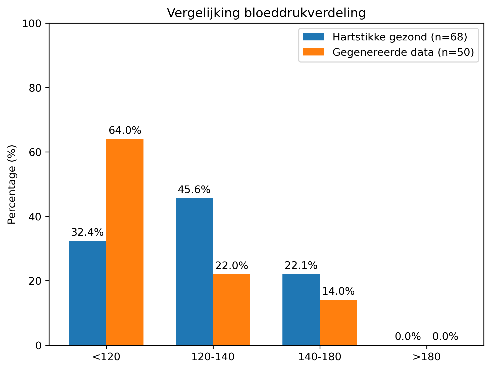

# Uitleg gegenereerde data

De toegereikte ECG-data is rechtsstreeks gebruikt. 
Voor de overige categorieën zijn er eerst 'meest voorkomende categorieën' met een normaalverdingsvorm gegenereerd, waar ongezonde categorieën oplopend minder kans hebben om gegenereerd te worden (Dit bestand is jammer genoeg niet opgeslagen, zie onderkant kopje voor meer uitleg). Vervolgens zijn de categorieën omgezet naar oplopende numerieke categorie-indexen ($x_i$). En is er vervolgens een gewogen categoriegemiddelde berekend, waarbij categorieën dicht bij de modus meer gewicht krijgen dan categorieën verder van de modus.

Er is gebruikgemaakt van een gewogen 'gemiddelde' waarbij de gewichten zijn bepaald met een Gaussische functie rond de modus (meest voorkomende categorie).
Hierbij krijgen categorieën die dichter bij de modus liggen een hoger gewicht dan categorieën die verder van de modus afliggen. Voor deze methode is gekozen omdat de werkelijke verdeling van de data onbekend is. Er is daarom aangenomen dat waarden die dichter bij de meest voorkomende categorie liggen waarschijnlijker zijn dan waarden die verder van deze categorie af liggen. Daarnaast is aangenomen dat de populatie overwegend gezond is, waardoor de meest voorkomende categorie in de richting van de gezonde categorieën is geplaatst.

| Non-HDL | Bloedsuiker  | Bloeddruk | Cholesterol | BMI |
| ------- | ------------ | --------- | ----------- | --- |
| ***< 3.8*** | ***< 7.8*** | ***< 120***     | ***< 5***         | < 18.5 |
| > 3.8   | 7.8 - 11     | ***120 - 140*** | 5 - 6.5     | ***18.5 - 25*** |
|         | > 11.1       | 140 - 180 | 6.5 - 8     | 25 - 30 |
|         |              | > 180     | > 8         | > 30 |

tabel 1. gezonde categorie per meetwaarde (***gezond***)

## Formules

De originele formule voor Gaussian kernel smoother is:

```math
K(x^*,x_i) = \exp(- \frac{(x^* - x_i)^2}{2b^2})
```
waar $x^*$ het evaluatiepunt is en b (sigma in excel) de lengteschaal is.

De gebruikte gewichten zijn berekend met:
```math
w_i = \exp( -\frac{(x_i-modus)^2}{2b^2})
```

De richting word gegeven door: 
```math
\exp(- \lambda \max\{0, x_i-n\})
```
of
```math
\exp(-\lambda |x_i-n|)
```

Waarin n de hoeveelheid gezonde categorieën is en waarbij:

- $x_i$ = de numerieke waarde van een categorie  
- modus = de modus (meest voorkomende categorie)  

Het uiteindelijke gemiddelde is bij alles behalve BMI vervolgens berekend als:
```math
\bar{x} =\frac
{\sum x_i \cdot \exp\!\left(-\frac{(x_i-\text{modus})^2}{2b^2}-\lambda \max\{0, x_i-n\}\right)}
{\sum \exp\!\left(-\frac{(x_i-\text{modus})^2}{2b^2}-\lambda \max\{0, x_i-n\}\right)}
```

Het gemiddelde voor BMI is berekend als:
```math
\bar{x} =\frac
{\sum x_i \cdot \exp\!\left(-\frac{(x_i-\text{modus})^2}{2b^2}-\lambda |x_i-n|\right)}
{\sum \exp\!\left(-\frac{(x_i-\text{modus})^2}{2b^2}-\lambda |x_i-n|\right)}
```

- n was hier bij alles 1 behalve bij Bloeddruk (Bovendruk).
- b was bij allen 1
- $\lambda$ of de 'bias' was 0.14 om het niet al te veel af te laten wijken van de originele categorie
\
## Vertaling naar excel

<h3>generatie van modi</h3>
Een voorbeeld van hoe de modi berekend zijn, in dit geval hoe de waarde van bloeddruk gegenereerd zou zijn:

=LET( r; RAND()*100; IFS( r<=63;"<120"; r<=83;"120-140"; r<=98;"140-180"; TRUE;">180"))

waar <120 63%, 120-140 20%, 140-180 15%, en >180 2% kans heeft om te genereren. Dit zijn bedachte hoeveelheden en zal dus niet (100%) met de realiteit overeenkomen.

<h3>berekening gewogen gemiddelde</h3>
Voor de functie die de maximale waarde benut is de volgende formule in excel gebruikt:

=SUM(\
$S$56*EXP(-(($S$56-$S28)^2)/(2*$S$61^2)-$S$63*MAX(0;$S$56-$S$65));\
$S$57*EXP(-(($S$57-$S28)^2)/(2*$S$61^2)-$S$63*MAX(0;$S$57-$S$65));\
$S$58*EXP(-(($S$58-$S28)^2)/(2*$S$61^2)-$S$63*MAX(0;$S$58-$S$65));\
$S$59*EXP(-(($S$59-$S28)^2)/(2*$S$61^2)-$S$63*MAX(0;$S$59-$S$65))\
)/\
SUM(\
EXP(-(($S$56-$S28)^2)/(2*$S$61^2)-$S$63*MAX(0;$S$56-$S$65));\
EXP(-(($S$57-$S28)^2)/(2*$S$61^2)-$S$63*MAX(0;$S$57-$S$65));\
EXP(-(($S$58-$S28)^2)/(2*$S$61^2)-$S$63*MAX(0;$S$58-$S$65));\
EXP(-(($S$59-$S28)^2)/(2*$S$61^2)-$S$63*MAX(0;$S$59-$S$65))\
)\
\
en voor de functie die de absolute waarden gebruikt:\
\
=SUM(\
$AA$56*EXP(-(($AA$56-$AA28)^2)/(2*$AA$61^2)-$AA$63*ABS($AA$56-$AA$65));\
$AA$57*EXP(-(($AA$57-$AA28)^2)/(2*$AA$61^2)-$AA$63*ABS($AA$57-$AA$65));\
$AA$58*EXP(-(($AA$58-$AA28)^2)/(2*$AA$61^2)-$AA$63*ABS($AA$58-$AA$65));\
$AA$59*EXP(-(($AA$59-$AA28)^2)/(2*$AA$61^2)-$AA$63*ABS($AA$59-$AA$65))\
)/\
SUM(\
EXP(-(($AA$56-$AA28)^2)/(2*$AA$61^2)-$AA$63*ABS($AA$56-$AA$65));\
EXP(-(($AA$57-$AA28)^2)/(2*$AA$61^2)-$AA$63*ABS($AA$57-$AA$65));\
EXP(-(($AA$58-$AA28)^2)/(2*$AA$61^2)-$AA$63*ABS($AA$58-$AA$65));\
EXP(-(($AA$59-$AA28)^2)/(2*$AA$61^2)-$AA$63*ABS($AA$59-$AA$65))\
)\
\
Met S56-S59: $x_i$, S28:modus, S61: b, S63: $\lambda$ & S65: n\
Voor de tweede geldt hetzelfde maar bevind het zich in een andere kolom dus is S vervangen door AA.

## Uitwerkingen
Hieronder een uitwerking van de bovenste formule met modus = 3 & n = 1


```math
\begin{align}
e^{-\frac{(1-3)^2}{2\cdot1^2} - 0.14\cdot\max(0, 1-1)} \; = \; e^{-\frac{4}{2} - 0.14 \cdot 0} \; = \; e^{- 2} \; = \; 0.1353352832 \\        
e^{-\frac{(2-3)^2}{2\cdot1^2} - 0.14\cdot\max(0, 2-1)} \; = \; e^{-\frac{1}{2} - 0.14 \cdot 1} \; = \; e^\frac{16}{25} \; = \; 0.527292424 \\
e^{-\frac{(3-3)^2}{2\cdot1^2} - 0.14\cdot\max(0, 3-1)} \; = \; e^{0 - 0.14 \cdot 2} \; = \; e^ {- 0.28} \; = \; 0.7557837415 \\
e^{-\frac{(4-3)^2}{2\cdot1^2} - 0.14\cdot\max(0, 1-1)} \; = \; e^{-\frac{1}{2} - 0.14 \cdot 3} \; = \; e^{- \frac{23}{25}} \; = \; 0.3985190411 \\
\\
\frac{1(0.1353352832)+2(0.527292424)+3(0.7557837415)+4(0.3985190411)}{0.1353352832 + 0.527292424 + 0.7557837415 + 0.3985190411} \; = \; \frac{5.05134752}{1.81693049} \; = \; 2.780154523 \; ≈ \; 2.78
\end{align}
```
## Analyse gegenereerde data


<table>
<tr>
<td style="width:55%">
  
</td>
<td style="width:45%">
  .........................................................................................................................................
</td>
</tr>
</table>

## Discussie
## Conclusie
## Bronnen en inspiratie
[Wikipedia - Kernel Smoother](https://en.wikipedia.org/wiki/Kernel_smoother)\
[Matplotlib - Barchart](https://matplotlib.org/stable/gallery/lines_bars_and_markers/barchart.html)\
[Scipy - Chi-kwadraat](https://docs.scipy.org/doc/scipy/reference/generated/scipy.stats.chi2_contingency.html )
